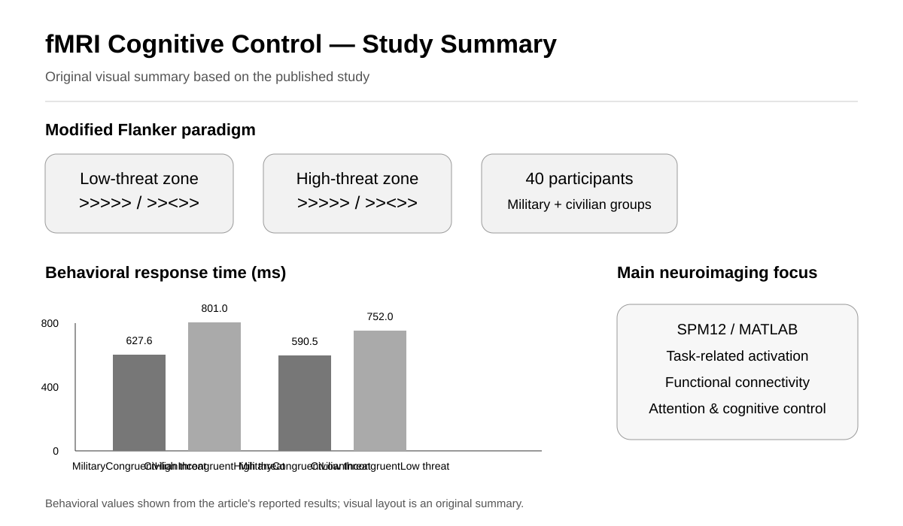

# fMRI-Cognitive-Control

## Attentional Control during Visual Modified Flanker Stimuli using fMRI Data



*Original visual summary based on the published study; behavioral values are taken from the reported results.*

This repository presents a research project investigating attentional control during a modified visual Flanker task using functional magnetic resonance imaging (fMRI).

The study examined task-related brain activity and functional connectivity associated with attentional processing and cognitive control.

## Research Question

How does the brain respond to attentional conflict during visual Flanker stimuli, and how are these responses reflected in brain activity and functional connectivity?

## Study Focus

- Attentional control
- Selective attention
- Cognitive control
- Visual Flanker task
- Task-related brain activity
- Functional connectivity
- Functional magnetic resonance imaging (fMRI)

## Study Design

The study included 40 participants, including military personnel and normal individuals. Participants performed a modified visual Flanker task while undergoing fMRI.

The task included congruent and incongruent trials in high-threat and low-threat environments. The analysis investigated brain responses associated with different task conditions and examined functional connectivity related to attentional processing.

## Analysis

The fMRI analysis included:

- Field map correction
- Co-registration
- Realignment
- Segmentation
- Normalization
- Smoothing
- First-level and second-level brain activation analysis
- Functional connectivity analysis

The project used MATLAB-based neuroimaging analysis tools, including SPM12.

## Research Workflow

```text
Modified Flanker Task
        ↓
fMRI Data Acquisition
        ↓
Preprocessing
        ↓
First-level / Second-level Analysis
        ↓
Brain Activation
        ↓
Functional Connectivity
        ↓
Cognitive Control
```

## Behavioral Findings

Military participants showed shorter mean reaction times than normal participants in the reported congruent and incongruent conditions, with the largest reported difference in the high-threat incongruent condition.

## Neuroimaging Findings

The study reported group- and condition-related differences in medial frontal regions and stronger functional connectivity in attention-related regions among military participants, particularly under high-threat conditions.

## Software and Tools

- MATLAB
- SPM12
- PsychoToolbox-3

## Publication

Sharini, H., Rajeyan, E., Faraji, S., Ahmadi, M., Faramarzi, A., & Jalalvandi, M. (2026).

**Attentional Control during Visual Modified Flanker Stimuli using fMRI Data.**

*Journal of Biomedical Physics & Engineering, 16*(4), 315–332.

- [Read the article](https://pmc.ncbi.nlm.nih.gov/articles/PMC13457681/)
- [DOI](https://doi.org/10.31661/jbpe.v0i0.2408-1813)

## Author

**Ayob Faramarzi**

Biomedical Engineering | Neuroimaging | fMRI | MRS | Brain Connectivity | Machine Learning

[Google Scholar](https://scholar.google.com/citations?hl=en&user=1uivc_4AAAAJ)

[LinkedIn](https://www.linkedin.com/in/ayob-faramarzi/)
